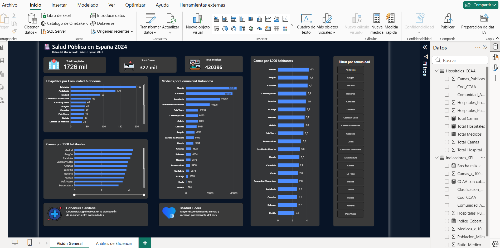
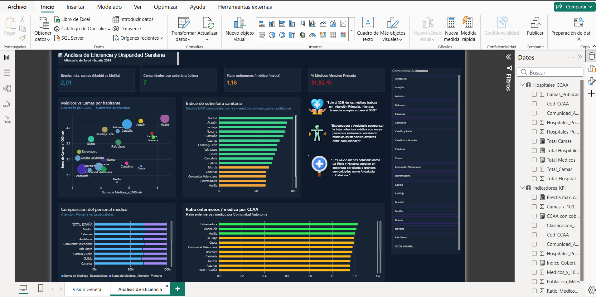

# 🏥 Salud Pública en España 2024
Dashboard interactivo desarrollado en Power BI sobre la distribución 
y eficiencia de recursos sanitarios en España.

## 📊 Descripción del proyecto
Análisis de datos del Ministerio de Salud de España 2024, 
explorando la distribución de hospitales, camas y médicos 
por Comunidad Autónoma, con foco en identificar brechas 
de cobertura y eficiencia entre regiones.

## 🗂️ Estructura del dashboard

### Hoja 1 — Visión General
Vista ejecutiva con KPIs nacionales y distribución 
de recursos por CCAA:
- Total de hospitales, camas y médicos a nivel nacional
- Ranking de hospitales y médicos por comunidad
- Camas por 1.000 habitantes por comunidad
- Filtro interactivo por comunidad autónoma

### Hoja 2 — Análisis de Eficiencia
Análisis profundo de disparidades y eficiencia sanitaria:
- Índice de cobertura sanitaria (medida DAX compuesta)
- Dispersión médicos vs camas por habitante
- Composición del personal médico (Atención Primaria vs Especialistas)
- Ratio enfermeros/médico por comunidad
- Conclusiones analíticas sobre brechas regionales

## 🛠️ Herramientas utilizadas
- **Power BI Desktop**
- **DAX** para medidas calculadas
- Datos: Ministerio de Salud · España 2024

## 📐 Medidas DAX desarrolladas
- `Indice_Cobertura` — índice normalizado 0-100 combinando camas y médicos per cápita
- `Brecha_Camas` — diferencia entre la CCAA con mayor y menor cobertura
- `CCAA_Cobertura_Optima` — comunidades sobre la media nacional en ambos indicadores
- `Ratio_Enfermeros_Medico` — enfermeros por médico como indicador de carga asistencial
- `% Médicos Atención Primaria` — proporción de médicos en primer nivel asistencial

## 📸 Capturas

### Visión General

### Análisis de Eficiencia

## 💡 Conclusiones principales
- Solo el 32% de los médicos trabaja en Atención Primaria, 
  frente a más del 50% de media europea
- Extremadura y Andalucía compensan la baja cobertura médica 
  con mayor presencia enfermera, revelando modelos asistenciales distintos
- Las CCAA menos pobladas como La Rioja y Navarra superan en cobertura 
  per cápita a grandes comunidades como Andalucía o Cataluña
- Madrid lidera en disponibilidad de camas y médicos por habitante, 
  con una brecha del 87% respecto a Melilla

## 👤 Autor
Jesica Radice · 
https://www.linkedin.com/in/jesica-radice-608974142/

## 👤 Autor
Jesica Radice · (https://www.linkedin.com/in/jesica-radice-608974142/) · 
